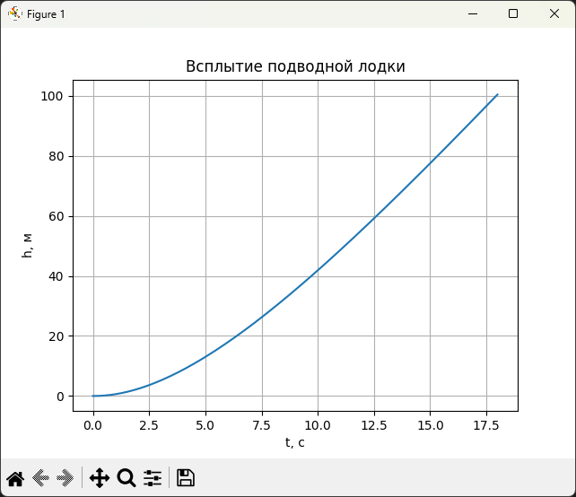
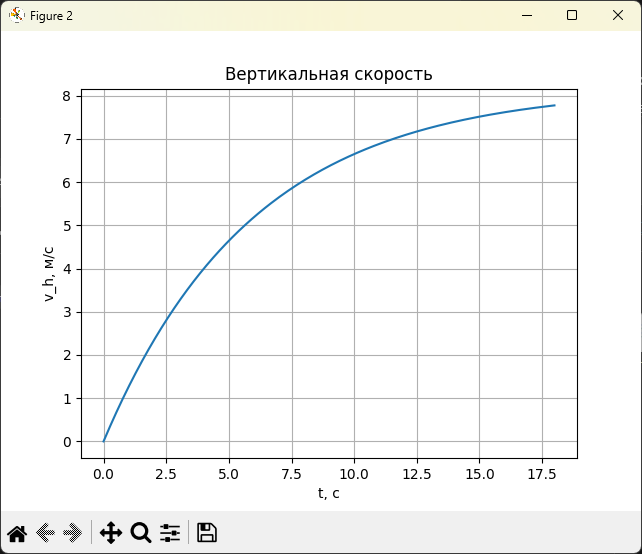
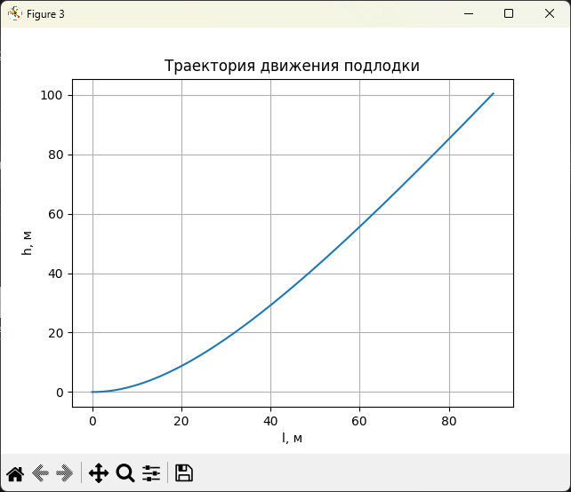

# Отчет по моделированию движения подводной лодки

> (readme версия, также есть pdf-версия)

---

## 1. Постановка задачи

Рассматривается движение подводной лодки, находящейся в начальный момент времени на глубине H и движущейся с постоянной горизонтальной скоростью v. В момент t = 0 подводная лодка получает команду на всплытие. В результате изменения заполнения балластных цистерн средняя плотность лодки становится меньше плотности воды, и на лодку начинает действовать выталкивающая сила Архимеда.

Цель работы:

* построить математическую модель движения подводной лодки;
* привести модель к безразмерному виду;
* разработать численный алгоритм решения;
* провести вычислительный эксперимент с учетом сопротивления воды.

---

## 2. Физическая модель

На подводную лодку в вертикальном направлении действуют:

* выталкивающая сила Архимеда: F = g · V · ρ0;
* сила тяжести: P = g · V · ρ1.

С учетом линейного сопротивления воды, пропорционального вертикальной скорости, уравнение движения имеет вид:

```
d²h/dt² = g·(ρ0 − ρ1)/ρ1 − (k/ρ1)·dh/dt
```

Горизонтальное движение считается равномерным:

```
dl/dt = v = const
```

---

## 3. Безразмеризация уравнений

Вводятся безразмерные переменные:

```
h = H · h~
t = T · t~
```

Характерное время:

```
T = sqrt( H·ρ1 / ( g·(ρ0 − ρ1) ) )
```

После подстановки получаем безразмерное уравнение:

```
d²h~/dt~² = 1 − β·dh~/dt~
```

где

```
β = (k / ρ1) · T
```

— безразмерный коэффициент сопротивления.

---

## 4. Система уравнений первого порядка

Вводится безразмерная вертикальная скорость:

```
u = dh~/dt~
```

Система уравнений:

```
dh~/dt~ = u
du/dt~  = 1 − β·u
```

Начальные условия:

```
h~(0) = 0
u(0)  = 0
```

---

## 5. Численный метод

Для численного решения используется явная схема Эйлера. Пусть Δt — шаг по безразмерному времени. Тогда разностные уравнения имеют вид:

```
h~(n+1) = h~(n) + Δt · u(n)
u(n+1)  = u(n)  + Δt · (1 − β·u(n))
```

Расчет продолжается до достижения условия всплытия:

```
h~ ≥ 1
```

---

## 6. Реализация алгоритма

Алгоритм реализован на языке Python с использованием библиотек numpy и matplotlib. В ходе расчета вычисляются:

* глубина как функция времени h(t);
* вертикальная скорость как функция времени;
* траектория движения подлодки h(l).

Графики используются для анализа динамики всплытия.

---

## 7. Вычислительный эксперимент

Для проведения вычислительного эксперимента использовались следующие параметры:

* начальная глубина: H = 100 м;
* ускорение свободного падения: g = 9.81 м/с²;
* плотность воды: ρ0 = 1025 кг/м³;
* средняя плотность подводной лодки: ρ1 = 900 кг/м³;
* коэффициент сопротивления воды: k = 150 кг/с;
* горизонтальная скорость: v = 5 м/с.

Численное решение выполнялось методом Эйлера с шагом Δt = 0.01 (в безразмерных переменных).

В результате вычислений получено:

* время всплытия до поверхности: ≈ 18.0 с;
* горизонтальное смещение: ≈ 90 м;
* предельная вертикальная скорость: ≈ 8.17 м/с.

Построены графики:

* h(t) — глубина от времени;
* v_h(t) — вертикальная скорость от времени;
* h(l) — траектория движения подводной лодки.





---

## 8. Выводы

В работе построена и исследована математическая модель всплытия подводной лодки с учетом сопротивления воды. Проведена безразмеризация уравнений движения, разработан численный алгоритм и выполнен вычислительный эксперимент.

Результаты показывают существенное влияние сопротивления среды на характер движения и подтверждают корректность выбранной модели. Представленный подход может быть использован для моделирования движения других тел в среде, например дирижабля в атмосфере.
